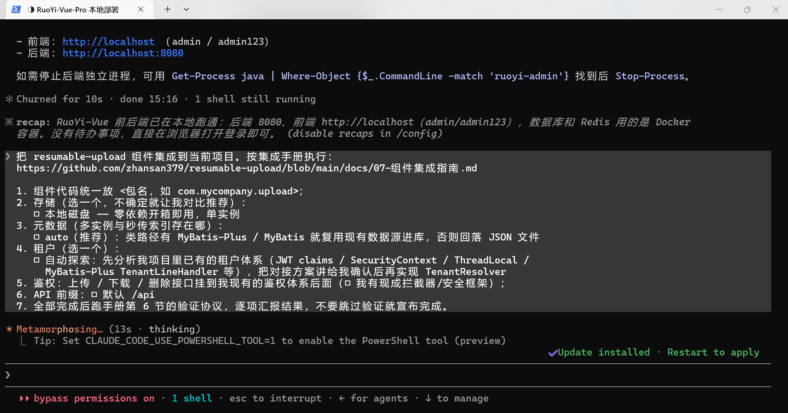
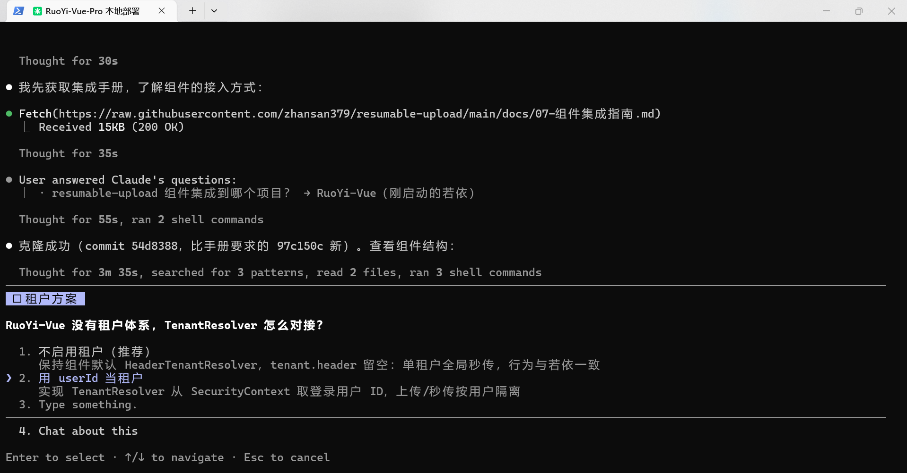
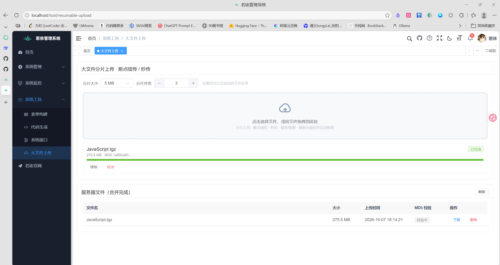

# resumable-upload · Large-File Upload Code Template, Built for AI Integration

[简体中文](README.md) | **English**

**This is not an upload website you deploy and forget — it is a code template for AI coding agents**: chunked upload, resumable transfers, instant upload (dedupe), integrity verification, and pluggable storage (local disk / S3-compatible object storage) are all split into cleanly bounded modules, packaged with an AI-executable integration guide and a Skill. The goal: let an AI agent install "large-file upload" into **your** system quickly and correctly — not migrate your business into this repo.

The design is based on a survey of 10+ popular open-source projects on GitHub (uppy, blueimp, filepond, fine-uploader, plupload, resumable.js, flow.js, simple-uploader, tus, free-fs, etc.).

## Quick Integration (two paths)

**For AI (recommended)**: install [skills/resumable-upload-integration/SKILL.md](skills/resumable-upload-integration/SKILL.md) into your coding agent (or just feed it the manual URL) and say "integrate large-file upload into my project". The agent follows [docs/07-组件集成指南.md](docs/07-组件集成指南.md) (the integration manual; written in Chinese):

- Precondition checks (Spring Boot 3.x + Java 17, stop immediately if unmet);
- A file-exact copy manifest (including "do NOT copy the demo shells" rules);
- Adaptation points: API prefix, auth interceptor, **tenant source** (if your system already has JWT/SecurityContext/MyBatis-Plus tenancy, implement one `TenantResolver` bean — the component never forces its own tenant header), storage choice (local / S3);
- **Step-by-step verification protocol** (curl smoke tests with expected responses) — AI integration is not guesswork; completion is machine-checkable.

Prompt template: **fill in each option to match your system and send it to the AI; leave items blank and add "explore my project first, then confirm with me" when unsure.** The more complete the info, the less the AI asks and guesses.

> Minimal version: Integrate large-file upload into my project. Integration manual: https://github.com/zhansan379/resumable-upload/blob/main/docs/07-组件集成指南.md — follow the manual; explore my project first and confirm with me on uncertain options; run the Section 6 verification protocol and report each result when done.

```text
Integrate the resumable-upload component into the current project. Follow the integration manual:
https://github.com/zhansan379/resumable-upload/blob/main/docs/07-组件集成指南.md

1. Put the component code under <package, e.g. com.mycompany.upload>;
2. Storage (pick one; ask me for a comparison if unsure):
   □ Local disk — zero-dependency, works out of the box, single instance
   □ Self-hosted object storage: MinIO / RustFS — I will provide endpoint / bucket / credentials
   □ Cloud object storage: Alibaba OSS / Tencent COS / Huawei OBS / AWS S3 — I will provide bucket and credentials
3. Metadata (where the dedupe index and multi-instance state live):
   □ auto (recommended): use MyBatis-Plus / MyBatis with my existing DataSource if present, otherwise fall back to JSON file
   □ Explicit: json / mybatis / mybatis-plus
4. Tenancy (pick one):
   □ Auto-explore: analyze my existing tenant system first (JWT claims / SecurityContext / ThreadLocal /
     MyBatis-Plus TenantLineHandler, etc.), present the wiring plan for my confirmation, then implement TenantResolver
   □ Manual: I will tell you where to get it (e.g. a unified header X-Tenant-Id)
   □ Not needed: single-tenant system (note: identical content dedupes globally, delete works by hash globally)
5. Auth: mount upload / download / delete behind my existing auth (□ I have an interceptor/security framework
   □ I don't — then explicitly warn me about anonymous write access);
6. API prefix: □ default /api  □ custom: <prefix> (avoid clashing with existing routes);
7. When everything is done, run the Section 6 verification protocol, report every result,
   and never declare completion without verification.
```

**For humans**: the same [docs/07-组件集成指南.md](docs/07-组件集成指南.md) works as a step-by-step guide — the frontend part (copy the panel component for Vue3, use the headless core for React/uniapp, with per-framework effort assessment and a manual verification checklist) is included. To see it live first, run the demo via `docker compose` ([docs/02-快速启动.md](docs/02-快速启动.md)).

**Why this is AI-integration-friendly**: the component source is small (~2,000 lines of backend core, ~550 lines of frontend core), dependencies are minimal, SPI boundaries are clean (five extension points — storage / metadata / merge lock / tenant / events — all follow "default implementation + host bean override"), and there are anchored versions plus regression tests. The classic AI failure modes (unverified changes, missed wiring annotations, assumed protocol fields) all have explicit defenses in the manual.

### Field Report: Full AI-Driven Integration into RuoYi (RuoYi-Vue-Pro)

The template above has been battle-tested end-to-end on **RuoYi (RuoYi-Vue-Pro)**, a popular Chinese admin framework: an AI coding agent drove the whole process — fetched this manual, explored the host stack, confirmed the tenant plan with the user (RuoYi has no tenancy; the AI offered "disabled / use userId as tenant"), pruned the copied sources to the host's stack (RuoYi is plain MyBatis, so the MyBatis-Plus implementation was removed), wired RuoYi's login auth, and finally a 275 MB file worked natively inside the RuoYi admin UI with chunked upload + instant upload. Seven host-environment pitfalls from this run (Druid nested datasource, host-global axios Content-Type pollution, Windows BOM, @MapperScan coverage, etc.) were fed back into [the Skill's adaptation checklist](skills/resumable-upload-integration/SKILL.md) so the next host never hits them.

| Host ready (RuoYi-Vue-Pro deployed locally) | AI triggered: fetch manual → confirm tenant plan |
|--------|--------|
|  |  |

**Result: the upload panel running natively inside the RuoYi admin (275 MB file completed)**



## Feature List

- **Chunked upload**: files are sliced in the browser (5 MB per chunk by default) and uploaded concurrently (3 by default, tunable 1–6) — far more resilient than a single big request on weak networks.
- **Resumable upload**: before uploading, the client asks the server which chunks already exist and skips them. Chunk state lives on the server storage — it survives server restarts and page refreshes.
- **Refresh recovery**: task metadata is persisted in the browser; after a refresh or reopen, tasks come back automatically — in-flight tasks resume, manually paused tasks wait. The computed MD5 is persisted too, so no re-hashing.
- **Instant upload (dedupe)**: the browser hashes the whole file (spark-md5 in a Web Worker); if the server index already has that content, the upload finishes instantly with zero bytes transferred.
- **Pause / resume**: pausing aborts in-flight chunks; resuming re-syncs with the server and continues with the missing chunks.
- **Automatic retry**: network errors and 5xx responses retry with 1s/2s/3s backoff; 4xx parameter errors fail fast instead of wasting retries.
- **Explicit merge**: after all chunks arrive, the client calls a merge endpoint; the server assembles chunks in order under a per-file lock, after verifying completeness and total size.
- **Integrity verification**: after merging, the server re-hashes the whole file in the background and compares it with the client's MD5 — a step most open-source implementations skip.
- **Download**: streamed without loading into memory; supports HTTP Range so browsers and download managers can resume and accelerate.
- **File management**: list, download, delete; cancelling an upload cleans up server-side chunks.
- **Pluggable storage**: local disk by default (zero dependencies, runs out of the box); one line of config switches to any S3-compatible storage (MinIO / RustFS / Alibaba OSS / Tencent COS / Huawei OBS / AWS S3...) — transparent to the protocol layer and the frontend.
- **Multi-instance**: metadata goes into the host database (**MyBatis / MyBatis-Plus implementations, auto-detected from the classpath**; falls back to a JSON file without a DB), and the merge lock upgrades to a database lease lock — horizontal scaling with object storage.
- **Multi-tenant**: pluggable tenant source — header-based by default, or implement one `TenantResolver` bean to reuse your existing tenancy (JWT / SecurityContext / MP TenantLineHandler); instant upload / download / delete / listing are all tenant-scoped, with charset validation against path injection.
- **Presigned direct upload (optional)**: with the S3 backend enabled, browsers upload straight to object storage and the server relays zero bytes; the server only signs chunk URLs, checks instant upload, and completes the multipart upload — clients never need to return ETags.
- **Frontend componentization (copy-in)**: the headless scheduler is decoupled from UI — the 4 core files work with any framework; Vue3 ships a zero-UI-library `<UploadPanel>` (drag & drop, progress, pause/resume, refresh recovery out of the box, styles fully replaceable). Like the backend, the AI copies the source — no npm package.

## Testing & Verification

One-line summary: **functional tests with zero errors, the bottleneck is home upload bandwidth rather than the server, the default parameters are already optimal, mid-upload process kill / full disk / OOM all recover, and on an extreme weak network traditional single-request upload can never finish while chunked upload completes.**

| Test | Plain-language result |
|--------|-----------|
| Functional end-to-end (7 JMeter groups) | 176 requests, 0 errors, passed on both loopback and public network |
| Performance | 100 MB over public network in ~21 s — saturated home upload bandwidth; loopback tests prove the server is not the bottleneck |
| Parameter scan | 2/10/20 MB chunks × concurrency 1/3/6 — none beat the default 5 MB / concurrency 3 |
| Boundary files & merge storm | 0-byte, oversized, and exactly-at-limit files all handled correctly; 1,000 concurrent 1 MB uploads survived with zero memory leak |
| Adversarial interruption | process kill mid-merge, full disk, OOM injection all recover; found and fixed a real corrupted-file bug along the way |
| Weak-network injection & baseline | on an extreme weak network, traditional single-request upload can never finish while chunked upload with adaptive concurrency downgrade completes |

Charts and raw data are in [docs/images/](docs/images); the full cases, injection methods, data and reproduction steps are in [docs/06-测试报告.md](docs/06-测试报告.md) (Chinese).

Beyond JMeter, the repo ships **8 JUnit integration suites with 41 test cases** (local disk / MinIO / RustFS containers / MyBatis / MyBatis-Plus / auto-detection / tenant isolation / host tenant resolver), all running the same protocol suite — `mvn test` regresses everything, and it is also the baseline for AI-integrated hosts to prove behavior wasn't broken.

### Remaining test ideas (TODO)

- [ ] **Cross-benchmark**: benchmark against free-fs / tusd under the same environment and load (throughput, recovery rate, resource usage) to establish the relative position.

## Roadmap (TODO)

- [ ] **Real-account cloud storage tests**: MinIO / RustFS already have container-level integration tests (8 S3 cases); add end-to-end verification with **real accounts** on Alibaba OSS / Tencent COS / Huawei OBS / AWS S3 — focusing on direct upload, instant upload, Range download and per-vendor multipart quota differences, producing a vendor S3-compatibility field report;
- [x] **Frontend componentization**: headless scheduler decoupled from UI, with the zero-UI-library Vue3 `UploadPanel.vue` ready to copy (**copy-in mode per user request — no npm package**);
- [x] **Frontend integration Skill**: merged into [skills/resumable-upload-integration](skills/resumable-upload-integration/SKILL.md) (one Skill for backend + frontend) — the user specifies framework (Vue3 / React / uniapp), UI or headless, transfer mode (relay / direct), and the AI executes the copy & adaptation with a verification checklist;
- [ ] **React implementation**: a React adapter for the uploader (hooks + component; the headless core is ready, only the adapter and examples are missing);
- [ ] **uniapp implementation**: adapt to uniapp's file picker and upload APIs (App / mini-program differences, mini-program concurrency and payload limits).

## Documentation (Chinese)

- [docs/07-组件集成指南.md](docs/07-组件集成指南.md): **the copy-in integration manual** (file manifest / adaptation points / verification protocol / troubleshooting table, executable by humans and AI; the companion AI Skill is [skills/resumable-upload-integration/](skills/resumable-upload-integration/SKILL.md)) — **start integration here**
- [docs/01-开源项目调研分析.md](docs/01-开源项目调研分析.md): survey of 10+ open-source upload projects and this project's design rationale
- [docs/02-快速启动.md](docs/02-快速启动.md): local dev quick start
- [docs/03-架构与实现.md](docs/03-架构与实现.md): architecture, storage layering (SPI), API reference, key implementation notes
- [docs/04-部署与CICD.md](docs/04-部署与CICD.md): server Docker deployment (one-click scripts), GitHub Actions CI/CD
- [docs/05-生产化建议.md](docs/05-生产化建议.md): production hardening checklist (what's built in vs. build-your-own)
- [docs/06-测试报告.md](docs/06-测试报告.md): full test report (parameter scan / boundary / adversarial interruption / weak-network injection / multi-backend integration tests)
- [jmeter/README.md](jmeter/README.md): JMeter test plan usage and HTML report generation
