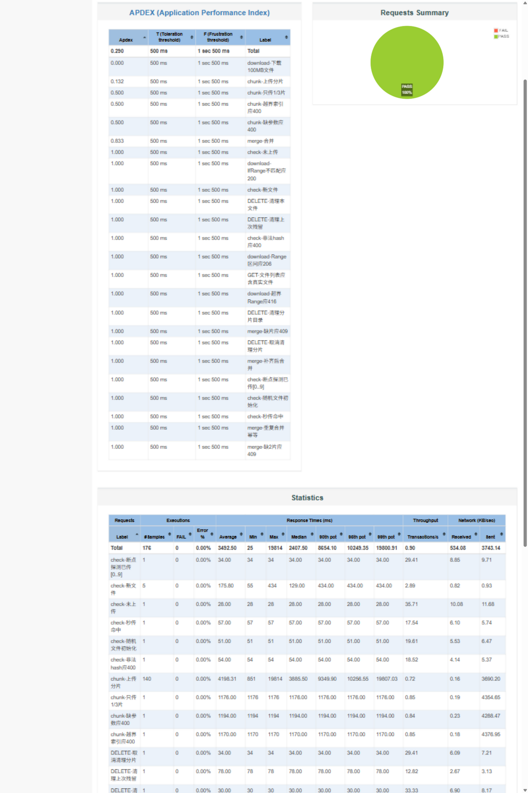
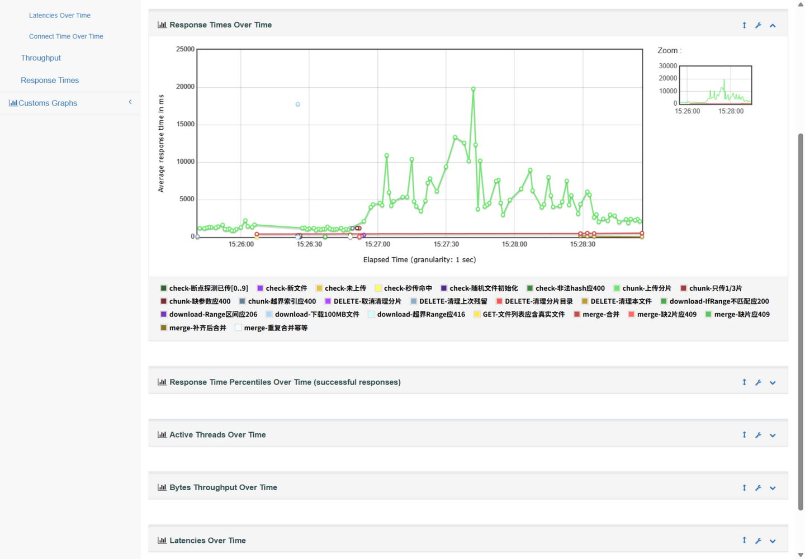
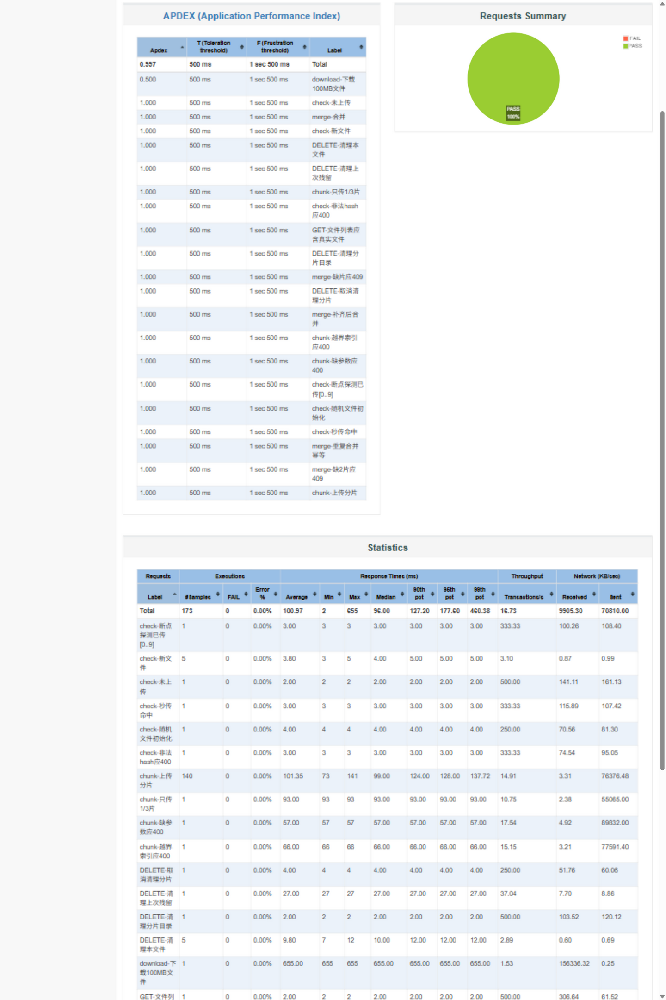
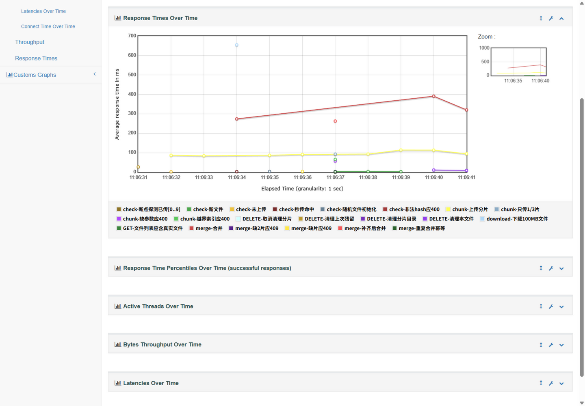
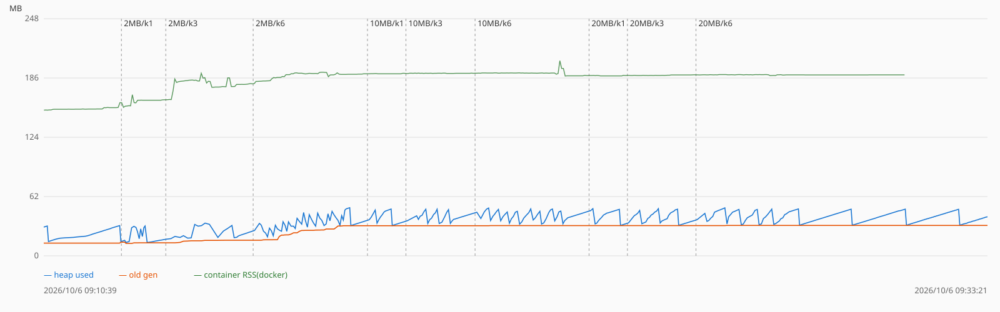
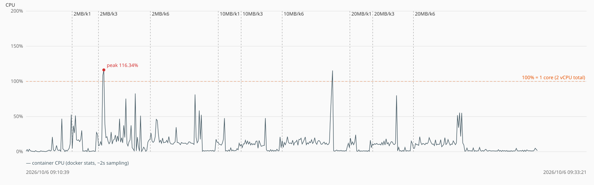
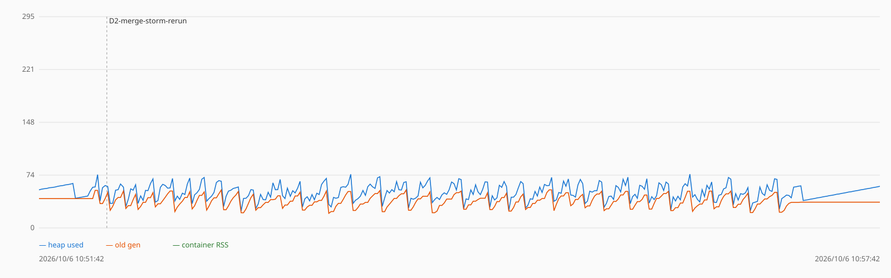

# 测试报告：功能、性能与健壮性

本文是完整测试记录：用例、注入方法、原始数据、结论与复现步骤。README 只保留结果一览，所有细节以本文为准。

## 0. 测试总览

| 测试项 | 日期 | 环境 | 结果 |
|--------|------|------|------|
| 功能全链路（JMeter 7 组） | 2026-10-05 | 本机回环 + 公网各一遍 | 176 请求 0 错误 |
| 参数扫描 | 2026-10-06 | 公网 | 9 组全链路 0 错误 |
| 边界文件与合并风暴 | 2026-10-06 | 公网 | 21 项断言全过，两轮风暴可重复 |
| 对抗性中断 | 2026-10-06 | 公网 | 发现并修复 1 个数据损坏 bug，3 项健壮性改进落地 |
| 弱网注入与基线对比 | 2026-10-06 | 公网（toxiproxy） | 12 场景，分片+自适应并发可完成、整文件不可能完成 |

服务端监控贯穿所有测试：JMX（SSH 隧道接入，VisualVM 实时观察）+ 1s 采样 JVM 内存 + docker stats 记录容器 CPU/内存。

---

## 1. 功能全链路（JMeter 7 组）

同一套 JMeter 5.6.3 测试计划（7 组场景、176 个请求）在**本机回环**和**公网服务器（阿里云）**各跑一遍，两次都 0 错误。

### 1.1 覆盖度：功能全链路 + 异常路径都有兜底

| 用例组 | 场景 | 结果 |
|--------|------|------|
| 02-完整上传 | 清理残留 → check → 20 片上传 → 合并 → 秒传复核 | ✅ 通过 |
| 03-秒传 | 同 hash 再 check | ✅ 命中，57ms |
| 04-下载 | 整文件 200 / Range 区间 206 / 超界 416 / 条件不匹配回退 200 | ✅ 4 条全过 |
| 05-断点续传 | 传一半 → 合并 409 → 断点探测 → 补齐 → 重复合并幂等 | ✅ 通过 |
| 06-异常边界 | 非法 hash 400 / 分片越界 400 / 缺参数 400 / 只传 1/3 片 409 | ✅ 全过 |
| 07-并发负载 | 5 线程 × 20 片 × 5MB 并发上传后删除 | ✅ 0 错误 |

> 每组运行前自动清理上次测试残留（01 组），保证结果可重复。本地与公网各跑一遍全部通过——这是"服务可用"的完整证据链。

### 1.2 性能：公网（阿里云，服务器带宽 100Mbps）

- **分片上传 140 次平均 4198ms**：瓶颈是客户端上行带宽（参数扫描实测单流与多流聚合均恒定在 4.6~4.8MB/s ≈ 38Mbps，见下文参数扫描），5 线程并发共享管道后单片延迟升到 3~7 秒。
- **下载 100MB 17.8 秒（约 5.6MB/s）**：实测约 45Mbps，未达服务器 100Mbps 标称上限。带宽上限的方向归属已用对照实验厘清（2026-10-06）：上传方向的上限在**客户端接入网上行**；下载方向的上限由**服务器出口带宽的计费状态**决定——当日复测发现 SSH 与 HTTP 两条独立通道被限到同一恒定速率（约 1.1Mbps，限速器特征），而客户端侧 RTT 17ms、零丢包、第三方镜像单流 4MB/s 正常，即限速发生在服务器出口侧、与客户端无关。
- **秒传 57ms、合并约 488ms**：跨公网的元数据接口依然毫秒级。

- **曲线解读**：分片上传主曲线在负载组 5 线程启动后从 1~2 秒抬升到 3~7 秒并抖动，结束后瞬间回落——这是 5 条连接瓜分同一条上行管道的带宽争用，不是服务端瓶颈；浅蓝那个点是 100MB 下载 17.8 秒，单独执行不与上传争抢。

### 1.3 性能：本地（NVMe SSD，网卡 300Mbps）

- **分片上传平均 101ms、P95 128ms**：5MB 一片稳定在 0.1 秒，并发期间几乎不变。
- **下载 100MB 655ms（约 192MB/s）**：本地回环不受网卡 300Mbps 限制，直读直发跑满磁盘管道。
- **合并 100MB 约 270ms**：并发合并时升到 370~390ms，仍远低于 1 秒。

- **本地数据的意义**：本地没有带宽瓶颈，分片延迟稳定在 0.1 秒——证明**服务端代码路径本身不是瓶颈**，公网慢是带宽的问题。本地测试的真正价值是在最快路径上暴露逻辑问题（比如 deleteFile 误删目录的 bug 就是本地下载用例 404 暴露的）。

---

## 2. 参数扫描：分片 2/10/20MB × 并发 1/3/6（公网 + 内存/CPU 监控）

在公网服务器（2 vCPU，容器 Xmx256m / 512M 限额）上跑 9 组参数组合（每组每线程独立上传 100MB 后删除），全程开启 JMX（SSH 隧道接入，VisualVM 实时观察），脚本 1s 采样 JVM 内存、docker stats 记录容器 CPU/内存。**9 组全链路 0 错误**，合并全部 <0.7s。

| 组 | 错误 | 分片平均/P95(ms) | 合并(ms) | 上传耗时(s) | 聚合吞吐(MB/s) |
|----|------|------------------|----------|-------------|----------------|
| 2MB / 并发1 | 0/53 | 423 / 531 | 535 | 21.2 | 4.7 |
| 2MB / 并发3 | 0/159 | 1587 / 3629 | 558 | 90.9 | 3.3 |
| 2MB / 并发6 | 0/318 | 2463 / 3534 | 662 | 129.1 | 4.6 |
| 10MB / 并发1 | 0/13 | 2087 / 2207 | 202 | 20.9 | 4.8 |
| 10MB / 并发3 | 0/39 | 6239 / 8239 | 245 | 65.1 | 4.6 |
| 10MB / 并发6 | 0/78 | 12517 / 17124 | 583 | 129.6 | 4.6 |
| 20MB / 并发1 | 0/8 | 4163 / 4355 | 220 | 20.8 | 4.8 |
| 20MB / 并发3 | 0/24 | 12153 / 15123 | 258 | 64.3 | 4.7 |
| 20MB / 并发6 | 0/48 | 24117 / 38445 | 386 | 129.6 | 4.6 |

结论：

- **吞吐与参数无关**：所有组合聚合吞吐都锁在 ~4.7MB/s（客户端上行带宽），CPU 均值 ≤25%（单核口径）、内存余量 4~5 倍——公网瓶颈在带宽，不在服务端，也不在分片参数。
- **分片太碎在高并发下真亏**：2MB/并发3 请求数暴涨（150 个），吞吐掉到 3.3MB/s，CPU 均值与峰值全场最高（25% / 116%）。
- **默认 5MB/并发 3 即合理工作点**：更大分片只增加单片在途时间（20MB×6 单片 P95 38s，弱网下放大超时/重试风险窗口），更小分片只增加请求开销，都换不来更高吞吐。
- **内存无泄漏、上传流式落盘**：全程 ~3GB 数据流过服务端，老年代预热后稳定在 31.8MB 一条水平线；堆峰值 ≤50MB / 上限 247.5MB，容器内存 ≤204MB / 限额 512M。堆峰值随并发连接数走、与分片大小无关（并发 6 时在途数据 12/60/120MB，堆峰值都是 ~50MB），证明分片直写磁盘不占堆。

> 数据与复现：结果、图表与采样 CSV 在 `jmeter/results/scan-params/`；扫描驱动 `scripts/run-param-scan.sh`、分析出图 `scripts/analyze-param-scan.mjs`、内存采样器 `scripts/MemorySampler.java`。

---

## 3. 边界文件与合并风暴（公网 + 容器内 JMX 采样）

边界语义成对探测（"恰好等于上限 / 上限+1"）+ 1000 个 1MB 小文件 20 并发合并风暴，21 项断言全部通过：

| 用例 | 结果 |
|------|------|
| 0 字节文件 | 分片与 merge 双层拒绝 400，无残留状态 |
| 恰好 1 个分片（5MB） | 全链路 200，下载 MD5 一致 |
| 恰好 20MB（multipart 上限） | 含边界被接受，合并成功 |
| 20MB+1 | 413，拒绝后服务健康 |
| 恰好 20GB / 20GB+1（总大小上限） | 含边界通过 / 超限 413 |
| totalChunks=100001 | 400 |
| 1000×1MB × 20 并发风暴 | 两轮 998→1000 全成功，风暴后状态完全复原 |

- **上限语义全部正确**：8 个边界点无一翻转，拒绝一律 400/413 且不残留脏状态。
- **死掉的请求不留下疤**：第一轮 2 个客户端超时的分片在服务端已完整落盘，但索引无幻影条目、日志零错误，孤儿分片经取消上传接口一键清理；第二轮复测 1000/1000（302s，含逐文件删除）验证可重复。
- **风暴下资源受控**（容器内 1s 采样，292 样本无缺口）：堆水位全程稳定在 70~75MB（上限的 30%），老年代峰值 53.2MB、风暴后回落至 36MB（净回收），200 次 FullGC 单次约 12ms（停顿占比 <1%），容器内存峰值 268MB / 512M，CPU 峰值 169%（2 vCPU 的 85%）——合并风暴里最先紧张的仍是 CPU。
- **发现一个运维盲点**：客户端消失（超时/崩溃/直接关页面）留下的孤儿分片目录目前没有自动过期清理机制，生产化需补一个定时清扫任务（见 docs/05）。

> 复现：`scripts/boundary-test.mjs`（`BASE_URL` 可指定环境）；容器内采样方案：`scripts/MemorySampler.java` 编译后 `docker cp` 进容器直连 `127.0.0.1:9010` 运行，避免 JMX 采样与压测流量抢同一根上行管道。

---

## 4. 对抗性中断（强杀 / 磁盘满 / OOM，发现问题 → 修复 → 回归）

对 500MB 真实文件（100 分片）做四类破坏性注入，合并期间用 `docker kill`（SIGKILL）直接打死容器，逐项核对磁盘与索引的一致性：

| 注入场景 | 结果 |
|----------|------|
| 上传中强杀 | ✅ 断点跨 SIGKILL 精确恢复：重启后 uploadedChunks 与磁盘逐片一致，续传后全链路成功 |
| 合并中强杀（7.5s 合并进行到 48%） | 🐛→✅ **发现并修复一个数据损坏 bug**（见下） |
| 合并后校验中强杀 | ⚠️→✅ 异步校验任务随进程死亡丢失，verified 永久卡在 false → 已修复：启动时重新入队 |
| 磁盘将满（仅剩 400MB 时合并 500MB） | ⚠️→✅ ext4 延迟分配吞掉 ENOSPC，合并"侥幸"成功而非显式报错 → 已修复：合并前置磁盘水位检查 |
| 后端 OOM（堆压到 128m + 1.2GB 并发突发） | ✅ 无法触发：流式写盘使堆占用与传输量无关，120 请求全部 200 |

**发现的数据损坏 bug 与修复回归**：合并中途死亡留下残缺目标文件（48% 大小），客户端重试 merge 会命中"目标文件已存在，跳过合并直接入索引"恢复路径——该分支不校验大小，半截文件被当作完整文件入库（服务端日志：打印"合并完成 524288000 bytes" → 0.9 秒后 `MD5 校验失败! 期望 a8fad... 实际 62fb73...`）。**修复**：恢复分支增加大小校验，不一致即删除残缺文件重新合并。回归验证同一场景：重试 merge 耗时 0.29s（假成功）→ **6.69s（真实重合并）**，MD5 校验失败 → **通过**，终态文件完整。

**随本轮落地的三项健壮性改进**（均已部署并回归验证）：

- **合并前置磁盘水位检查**：可用空间不足时显式拒绝（tus 语义 507，含剩余/需要的字节数），不再赌 ENOSPC 的行为
- **启动时重新入队校验**：对 verified=false 的记录在 ApplicationReady 时重算 MD5，重启后不再永久"校验中"
- **孤儿分片定时清理**：客户端消失（崩溃/断网/直接关页面）后取消接口不会被调用，其分片目录按 TTL（默认 24h）每小时清扫——边界测试发现的问题在此一并解决

> 复现：`scripts/adversarial-test.mjs`（upload/check/merge/verify 子命令，由 `scripts/run-adversarial.sh` 编排注入时机）；修复回归 `scripts/retest-s1b2.sh`。公网出口带宽受限时 500MB 下载校验不可用，完整性以服务端异步 MD5 校验（真实 hash）为准。

---

## 5. 弱网注入与基线对比（toxiproxy 前置注入，量化分片设计的收益）

toxiproxy 接管公网 8080（客户端地址不变、无感知），对同一服务、同一路径注入延迟/连接中断/带宽限制；对照组"传统整文件上传"用同一 API 但采用传统语义（顺序单流、无分片重试、任一失败从头再来）。100MB 真实文件、服务端 MD5 校验判定数据完整性：

| 场景 | 分片上传（可续传） | 整文件上传（从头重来） |
|------|--------------------|------------------------|
| 基准（无注入） | 34.4s ✅ | 37.0s ✅ |
| 延迟 100ms（双向） | 34.3s ✅ | 32.2s ✅ |
| 连接中断 1% / 5% | 38.5s / 27.8s ✅ | 27.6s ✅ |
| 中断 5% + 延迟 100ms | 30.5s ✅ | 32.2s ✅ |
| **连接存活上限 1.5s** + 上述弱网 | **并发 1：24.1s ✅**；并发 3：480s 重传 1GB 仍无法完成 | **6.3s 放弃，数学上不可能完成** |
| 上行限速 250KB/s | 151.5s ✅（4.4 倍降速，零重试） | - |
| 乱序 + 重复分片 + 弱网 | 35.6s ✅，MD5 通过（写入幂等、与到达顺序无关） | - |

- **量化收益**：连接存活上限 1.5s 的极端弱网下，整文件上传单请求需 4.3s > 1.5s，**每次重启都从头来，数学上不可能完成**（6.3s 内 3 次重启后放弃，每次仅推进 20MB）；分片上传把重传粒度降到 5MB（1.3s/片），配合断点续传可以完成——这就是分片设计的核心收益。
- **极端弱网下并发度是生死参数**：连接存活 1.5s 时并发 3 把 4.7MB/s 带宽摊薄，每片需 ~3.2s 必超窗口——重传 1GB 也无法集齐分片；并发 1 独占带宽（1.06s/片 < 1.5s）后 20 片零重试全部成功。**弱网自适应降并发比分片重试更关键**。
- **自适应并发已实现并回归验证**（AIMD）：上传器内置弱网自适应——分片重试耗尽的传输类失败 → 并发减半（下限 1），连续成功 10 片 → +1 爬回用户设定值；只动调度、不改分片大小（分片大小是任务身份的一部分，中途改变会作废断点进度）。RST 断连窗口注入下实测：检测到连续失败后并发 3 → 自动降为 1 → 64.8s 完成（固定并发对照 73.8s、重传开销 355MB）；正常网络不触发。
  - 触发规则：仅当分片**重试耗尽**（1s/2s/3s 退避后仍失败）且失败为**传输类**（网络错误/超时/5xx/429；4xx 参数错误不触发）时并发减半，在途请求不打断；正常网络全程保持用户设定值。恢复故意比降级慢：连续成功 10 片才 +1，避免在网络抖动区间反复横跳；累计 6 轮自适应仍无法完成则转整体失败语义，用户手动重试时从学到的并发值继续（弱网信号不丢弃）。
- 轻度弱网（≤5% 中断、100ms 延迟）对分片上传影响轻微：吞吐由客户端上行主导，重试机制全程兜底；限速场景耗时线性放大、零重试。
- 乱序到达 + 重复覆盖写分片后合并成功且校验通过——服务端"磁盘为事实源、分片原子落盘"与到达顺序无关的设计得到验证。

> 注入实现：toxiproxy 以宿主机进程运行（API 仅绑 127.0.0.1），前置公网 8080；「丢包/断连」以连接级中断建模——宿主内核（Alibaba Cloud Linux 5.10.134）不含 sch_netem 模块，包级丢包不可用，如实标注。复现：`scripts/weaknet-test.mjs`（chunks/wholefile/chaos 三模式 + 并发度参数）+ `scripts/run-weaknet.sh`；自适应并发的回归验证用 `scripts/uploader-harness.mjs`——Node 直载**真实前端 Uploader 代码**（axios adapter 桥接 + 模块 loader 补扩展名解析），在注入网络下运行生产代码路径。

---

## 6. 测试工具索引

| 工具 | 用途 |
|------|------|
| `jmeter/resumable-upload-test.jmx` | 基础功能/性能测试计划（7 组） |
| `jmeter/resumable-upload-scan.jmx` | 参数扫描计划（chunkSize/totalChunks/loadThreads 参数化） |
| `scripts/run-param-scan.sh` / `analyze-param-scan.mjs` | 参数扫描驱动与汇总出图 |
| `scripts/boundary-test.mjs` / `analyze-boundary.mjs` | 边界用例与合并风暴 + 结果分析 |
| `scripts/adversarial-test.mjs` / `run-adversarial.sh` / `retest-s1b2.sh` | 对抗性中断命令工具、编排与修复回归 |
| `scripts/weaknet-test.mjs` / `run-weaknet.sh` | 弱网注入双模式客户端与 toxiproxy 编排 |
| `scripts/MemorySampler.java` | JMX 内存采样器（支持隧道接入与容器内运行两种方式） |
| `scripts/uploader-harness.mjs` | Node 直载真实前端 Uploader 的弱网验证台 |
| `scripts/e2e-backend.mjs` | 后端 E2E 冒烟（12 用例） |

服务端监控贯穿全程：JMX 端口仅绑定服务器 127.0.0.1，经 SSH 隧道（`ssh -N -L 9010:127.0.0.1:9010`）接入，VisualVM 实时观察 + `MemorySampler` 采样 CSV；容器级 CPU/内存用 docker stats 采样。
